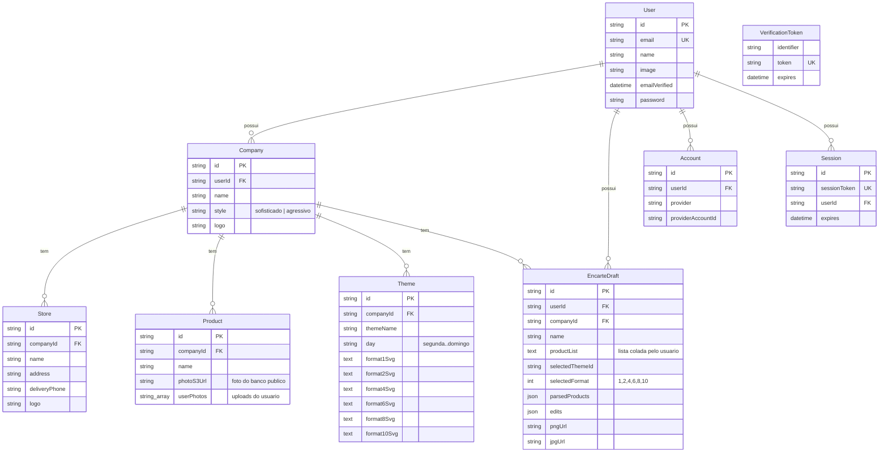

# Schema do banco — Encarte Gerador

PostgreSQL, gerenciado pelo Prisma. Schema fonte:
[`backend/prisma/schema.prisma`](../backend/prisma/schema.prisma) — um único
arquivo, gerando **dois** Prisma Clients idênticos (`backend/src/generated/prisma`
e `frontend/src/generated/prisma`), porque o NextAuth roda no frontend e
precisa falar com as mesmas tabelas `Account`/`Session`/`VerificationToken`.

## Diagrama ER



## Tabelas da aplicação

### `User`

Um usuário — em `AUTH_MODE=local` sempre o mesmo registro fixo (criado sob
demanda a partir de `LOCAL_USER_EMAIL`); em `AUTH_MODE=google`, um por login.
Dono de tudo (`Company`, `EncarteDraft` diretamente; `Store`/`Product`/`Theme`
transitivamente, via `Company`).

### `Company`

Nó raiz do catálogo de um negócio. `style` decide a paleta usada nos temas
("sofisticado" = preto e dourado, "agressivo" = amarelo e preto).
`onDelete: Cascade` em `userId` — apagar o usuário apaga a empresa (não
acontece na prática em `AUTH_MODE=local`, onde o usuário nunca é removido).

### `Store`

Loja física de uma empresa (endereço + telefone de entrega), usada no
rodapé do encarte. `onDelete: Cascade` em `companyId`.

### `Theme`

Uma "roupagem" visual: nome livre + dia da semana sugerido + os **6 SVGs**
(um por formato de grid — 1, 2, 4, 6, 8, 10 itens), guardados como `@db.Text`
porque um SVG de tema passa fácil de milhares de caracteres.

### `Product`

Um item do catálogo. `photoS3Url` é a foto "oficial" usada na geração;
`userPhotos` (`String[]`) guarda uploads adicionais do usuário — a Etapa 21
deixa escolher, por encarte, qual das duas usar. Apesar do nome
(herdado de quando só existia S3), a URL pode apontar para
`backend/uploads/` (modo local) ou para um bucket S3, conforme `STORAGE_MODE`.

### `EncarteDraft`

Um rascunho salvo: a lista de texto original (`productList`), a seleção de
tema/formato, o resultado já processado (`parsedProducts`, JSON) e eventuais
edições manuais de tamanho/posição (`edits`, JSON livre). `pngUrl`/`jpgUrl`
guardam o link da última exportação, se o usuário optou por persistir.

## Tabelas do NextAuth

`Account`, `Session` e `VerificationToken` seguem exatamente o schema exigido
pelo `@auth/prisma-adapter` — não são tocadas por código da aplicação, só
pelo NextAuth internamente. Só entram em jogo com `AUTH_MODE=google`; em
`AUTH_MODE=local` ficam vazias.

## Convenções

- Toda PK é `cuid()` (string), não serial numérico.
- Toda tabela de domínio tem `createdAt` (`@default(now())`) e `updatedAt`
  (`@updatedAt`, atualizado automaticamente pelo Prisma).
- Toda relação para baixo (`Company → Store/Product/Theme/EncarteDraft`,
  `User → Company/EncarteDraft`) usa `onDelete: Cascade`: apagar o pai apaga
  os filhos, sem deixar linha órfã.
- Para gerar/atualizar os dois Prisma Clients depois de mudar o schema:
  ```bash
  npm run db:migrate -w backend   # cria a migration e já regenera os clients
  # ou, sem criar migration:
  npx prisma generate --schema backend/prisma/schema.prisma
  ```
